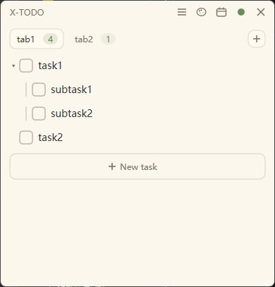
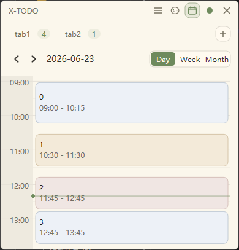

<div align="center">


# X-TODO

**Your day, pinned to the desktop.**

[](https://github.com/xwysyy/X-TODO/actions)


[](https://github.com/xwysyy/X-TODO/releases/latest)
[](LICENSE)

**English** | [简体中文](README.zh-CN.md)

</div>

---

<div align="center">
<table>
<tr>
<td align="center"><br><sub><b>Tasks</b></sub></td>
<td align="center"><br><sub><b>Calendar</b></sub></td>
<td align="center"><br><sub><b>Side capsule</b></sub></td>
</tr>
</table>
</div>

## 📌 What is X-TODO

**X-TODO** is a lightweight desktop planner for Windows that keeps your task list and your daily schedule in one always-on note. Write tasks as a **nested outline**, then switch to the **calendar** and block them onto a real day, week, or month timeline. When you need the screen back, fold the whole thing into a **side capsule** at the edge. It runs as a single native exe and saves everything to one local file, reopening exactly where you left it.

## ✨ Features

- **Outline-style tasks.** One line per task, up to three levels deep. Fold a parent, drag a branch to reorder, and finished items collapse into a Completed section.
- **Day / week / month calendar.** In day view, drag across empty hours to block out time; drag a block to move it, drag its edges to resize, all snapping to 15 minutes. Week and month give the overview, and clicking a day opens it for editing.
- **Three desktop modes.** Keep it as a normal window, sink it into the desktop, or fold it into a side capsule that slides out on hover.
- **Local-first storage.** Everything is a single JSON file in `%APPDATA%`, with optional hourly backup to a folder you choose.
- **Themeable.** Five built-in light themes, custom `.xtheme` files, or follow the Windows light/dark mode.
- **Stays in the tray.** Closing hides it, a double-click brings it back, and startup launch is optional.
- **Native and small.** Pure Win32 + Direct2D, one portable exe, about 1 MB.

## 📥 Download

Open [Releases](https://github.com/xwysyy/X-TODO/releases), download `x-todo.exe` from the latest version, and double-click it. Portable, no install. Development builds are still available from the [Actions](https://github.com/xwysyy/X-TODO/actions) artifacts.

> Tasks are stored in `%APPDATA%\x-todo\data.json`. Settings can also mirror that file to `<backup folder>\data.json`. Uninstalling leaves the app data folder untouched; copy it to another machine and your list comes along.

## ⌨️ Usage

| Action | How |
| :-- | :-- |
| Add | Click "＋ New item" at the bottom, or press Enter while editing to insert after the current item and its children |
| Done / undo | Click the box in front of an item; child items move with it as one block |
| Edit | Click the item text and type |
| Indent / outdent | Edit an active item, then press Tab or Shift+Tab |
| Collapse children | Click the disclosure arrow on a parent item |
| Rename / delete list | Double-click a list tab to rename it, or right-click a tab for rename/delete |
| Delete | Hover an item, click ×, confirm; child items are deleted with it |
| Reorder | Drag the handle on the right of an item; child items move with it |
| Move / resize | Drag the title bar to move, drag the edges to resize |
| Switch layout | Right-click the tray icon: normal window / desktop / side capsule |
| Open calendar | Click the calendar button in the title bar to switch between lists and the calendar |
| Block time | In day view, drag across empty hours to create a block; drag its body to move, drag its edges to resize |
| Edit a block | Click a block to edit its title and start/end time inline; right-click to delete |
| Calendar view | Use the Day / Week / Month control in the calendar header; click a day in week or month to open it |
| Settings | Open Settings from the title-bar or tray menu to change language, startup launch, and backup folder |
| Backup | Pick a folder in Settings; X-TODO overwrites `<folder>\data.json` about once per hour |

## 🎨 Themes

Five built-in themes: Paper, Mint, Sky, Rose, and Sand. Right-click the tray icon or open the title-bar menu and pick one under "Theme". Choose "Follow system" to track the Windows light/dark mode automatically. Switching a theme recolors the main window, menus, the confirm dialog, the Settings window, the theme manager, and the inline editor. The folded side entry and tray keep fixed app colors.

### 🖌️ Custom themes

Drop a `.xtheme` file into `%APPDATA%\x-todo\themes\` and click "Reload" in the theme manager. The file is strict JSON describing colors and display names only — no images, scripts, URLs, or external paths. Rough shape:

```json
{
  "schema": 1,
  "id": "custom.morning-paper",
  "name": { "zh": "晨纸", "en": "Morning Paper" },
  "dark": false,
  "colors": { "paper": "#fbf7ec", "text": "#33312c", "checkFill": "#7c9a6b", "danger": "#c8755e" },
  "capsule": { "slimPaper": "#fbf7ec", "slimAlpha": 0.6 },
  "tray": { "background": "#fbf7ec", "mark": "#7c9a6b" }
}
```

Colors are `#rrggbb`. The full field set (21 in `colors`, 10 in `capsule`, 4 in `tray`) is large; "Export current theme" in the theme manager writes a ready-to-edit template. The folded side entry uses fixed app colors; `capsule` remains in the theme format.

## 🛠️ Build

On push, GitHub Actions builds it with MSVC and uploads the exe to that run's Artifacts. Version tags such as `v0.1.0` also publish a GitHub Release with the exe attached.

To build it yourself on Windows with Visual Studio (Desktop development with C++):

```powershell
cmake -B build -A x64
cmake --build build --config MinSizeRel
```

Stack: C++17, Win32, Direct2D / DirectWrite, CMake, statically linked CRT, single exe.

## 📄 License

[MIT](LICENSE)

JSON parsing uses [nlohmann/json](https://github.com/nlohmann/json) v3.11.3 (MIT), vendored as a single header in `third_party/nlohmann/`.
